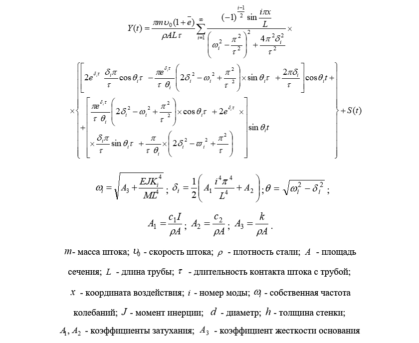
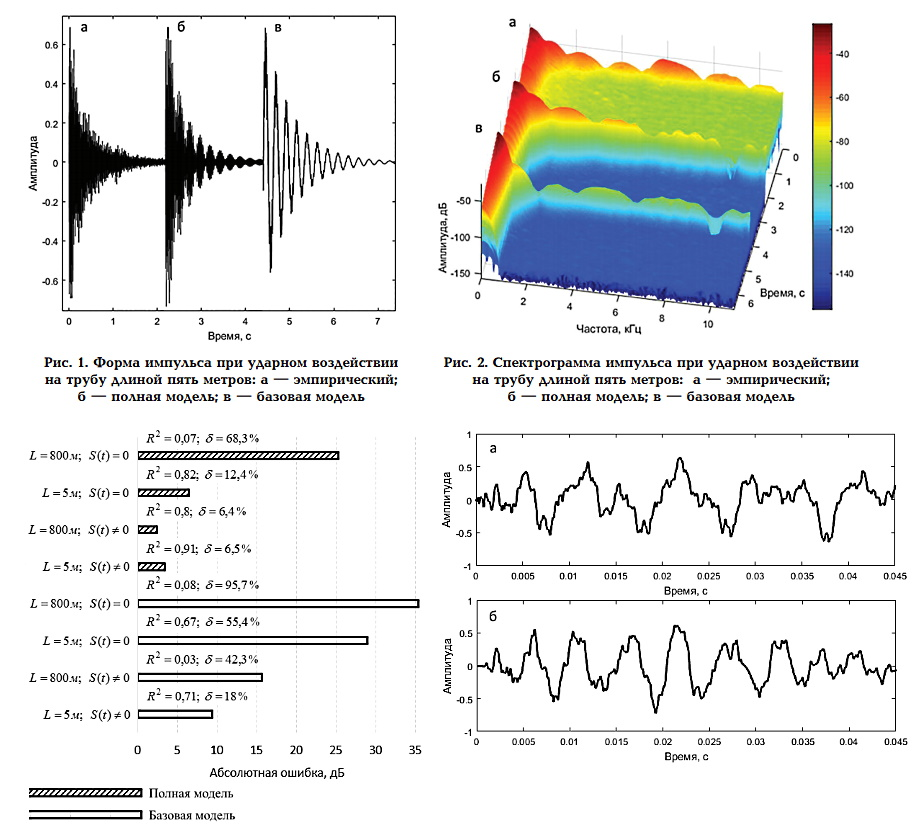
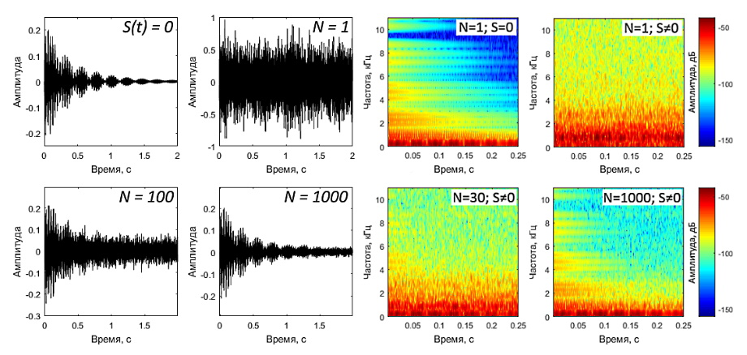

# AcousticModels

Скрипты Matlab для генерации wav-файлов, содержащих аналитические модели импульсов колебаний трубопровода, формируемых точечным воздействием на его поверхность.

## Две модели

"Базовая" и "Полная" модели, основаны на теории колебаний стержня и балки:

+ Impact. Theory and Physical Properties of Impacted Bodies. Goldsmith W., 1960
+ Vibration problems in engineering. Timoshenko S.P., Young, D.H., Weaver W., 1967

## Параметры моделей:

- Координата воздействия и приема сигнала
- Масса трубопровода
- Протяженность трубопровода
- Толщина стенки трубы и ее диаметр
- Плотность материала стенки трубопровода
- Модуль Юнга
- Коэффициент жесткости основания трубопровода
- Длительность контакта источника колебаний с поверхностью трубы
- Число мод
- Частота дискретизации сигнала
- Длительность сигнала

## Функционал скриптов:

- Генерация моделируемых импульсов в wav-файлы 
- Когерентное накопление сигналов для повышения отношения сигнал/шум
- Построение формы сигнала и амплитудно-частотного спектра
- Построение 3d-спектрограммы сигнала
- Наложение помехи на моделируемый сигнал

## Базовая модель:

* * *

## Полная модель:

## Оценка адекватности:

* * *

## Когерентное накопление

